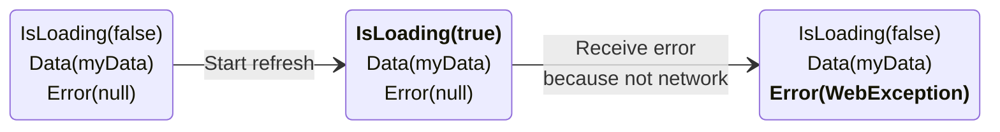

# Chinook.DataLoader

[](LICENSE)  

Customizable async data loading recipes for MVVM development.


> 🎥 Here we can see the **loading**, **error**, and **data** visual states.

## Cornerstones

- **Highly Extensible**
  - Everything is interface-based to easily allow more implementations.
  - A single framework can't cover everything.
    Our architecture is designed in a way that allows you to integrate your favorites tools easily.
- **Highly Flexible**
  - "Data loading" is a broad topic.
    We aim for our recipes to be flexible enough to support as many use-cases as possible.

### More like this
The Chinook namespace has other recipes for .Net MVVM applications.
- [Chinook.DynamicMvvm](https://github.com/nventive/Chinook.DynamicMvvm): MVVM libraries for extensible and declarative ViewModels.
- [Chinook.Navigation](https://github.com/nventive/Chinook.Navigation): Navigators for ViewModel-first navigation.
- [Chinook.BackButtonManager](https://github.com/nventive/Chinook.BackButtonManager): Abstractions to deal with hardware back buttons.

## Getting Started

1. Install the latest version of `Chinook.DataLoader.Uno` or `Chinook.DataLoader.Uno.WinUI` in your project.

1. Add a `IDataLoader` to your ViewModel. 

   ```csharp
   public MainPageViewModel()
   {
     MyAsyncValue = DataLoaderBuilder<int>
       .Empty
       .WithName("MyAsyncValue")
       .WithLoadMethod(LoadMyAsyncValue)
       .Build();
   }

   public IDataLoader<int> MyAsyncValue { get; }

   private async Task<int> LoadMyAsyncValue(CancellationToken ct, IDataLoaderRequest request)
   {
      // Your async operation here.
      await Task.Delay(1000, ct);
      return default(int);
   }
   ```
   > 💡 If you use [Chinook.DynamicMvvm](https://github.com/nventive/Chinook.DynamicMvvm), you can simplify the declaration.
   > More on that [here](#DynamicMvvm).

1. Add a `DataLoaderView` style in your xaml.
   <details>
   <summary>Expand to see code sample.</summary>
   <p>

   You can add the following `DataTemplate`s and `Style` to you `Page.Resources` or to a merged dictionary in you App.xaml.
   Feel free to copy and modify this code.
   ```xml
   <DataTemplate x:Key="DataLoaderViewEmptyTemplate">
        <Grid>
            <TextBlock Text="Nothing to show here"
                        HorizontalAlignment="Center"
                        VerticalAlignment="Top"
                        Margin="0,44,0,0" />
        </Grid>
    </DataTemplate>

    <DataTemplate x:Key="DataLoaderViewErrorNotificationTemplate">
        <Grid Background="#570000"
              VerticalAlignment="Bottom"
              Padding="8">

            <Grid.ColumnDefinitions>
                <ColumnDefinition Width="*" />
                <ColumnDefinition Width="Auto" />
            </Grid.ColumnDefinitions>

            <TextBlock Foreground="White"
                        HorizontalAlignment="Left"
                        VerticalAlignment="Center">
    <Run Text="Something went wrong." />
    <Run Text="{Binding Error.Message}" />
            </TextBlock>

            <!-- Try Again Button -->
            <Button Content="Try Again"
                    Background="#990000"
                    HorizontalAlignment="Center"
                    Command="{Binding View.RefreshCommand}"
                    Grid.Column="1" />
        </Grid>
    </DataTemplate>

    <!-- Error State -->
    <DataTemplate x:Key="DataLoaderViewErrorTemplate">
        <Grid>
            <StackPanel VerticalAlignment="Center"
                        HorizontalAlignment="Stretch">

                <!-- Title -->
                <TextBlock Text="Something went wrong"
                            TextAlignment="Center"
                            Margin="0,0,0,8" />

                <!-- Message -->
                <TextBlock Text="Please try again."
                            TextAlignment="Center" />

                <!-- Try Again Button -->
                <Button Content="Reload content"
                        HorizontalAlignment="Stretch"
                        Command="{Binding View.RefreshCommand}"
                        Margin="22,24,22,0" />
            </StackPanel>
        </Grid>
    </DataTemplate>

    <Style x:Key="DefaultDataLoaderViewStyle"
            TargetType="dl:DataLoaderView">
        <Setter Property="IsTabStop"
                Value="False" />
        <Setter Property="HorizontalAlignment"
                Value="Stretch" />
        <Setter Property="VerticalAlignment"
                Value="Stretch" />
        <Setter Property="HorizontalContentAlignment"
                Value="Stretch" />
        <Setter Property="VerticalContentAlignment"
                Value="Stretch" />

        <Setter Property="EmptyTemplate"
                Value="{StaticResource DataLoaderViewEmptyTemplate}" />
        <Setter Property="ErrorTemplate"
                Value="{StaticResource DataLoaderViewErrorTemplate}" />
        <Setter Property="ErrorNotificationTemplate"
                Value="{StaticResource DataLoaderViewErrorNotificationTemplate}" />

        <!-- This represents the minimum duration of a visual state.
    You should keep this high enough to prevent visual states from changing too fast.
    This is the property that prevents flickers. -->
        <Setter Property="StateMinimumDuration"
                Value="0:0:1.5" />

        <!-- This represents the time before updating to a new state during which another update can happen.
    You should keep this low enough to prevent slowing down your user experience.
    This is the property that prevents seeing loading states that are not necessary. -->
        <Setter Property="StateChangingThrottleDelay"
                Value="0:0:0.100" />

        <Setter Property="Template">
            <Setter.Value>
                <ControlTemplate TargetType="dl:DataLoaderView">
                    <Grid>
                        <VisualStateManager.VisualStateGroups>

                            <VisualStateGroup x:Name="DataStates">
                                <VisualState x:Name="Initial" />
                                <VisualState x:Name="Data">
                                    <VisualState.Setters>
                                        <Setter Target="ContentPresenter.Visibility"
                                                Value="Visible" />
                                    </VisualState.Setters>
                                </VisualState>
                                <VisualState x:Name="Empty" />
                            </VisualStateGroup>

                            <VisualStateGroup x:Name="ErrorStates">
                                <VisualState x:Name="NoError" />
                                <VisualState x:Name="Error" />
                            </VisualStateGroup>

                            <VisualStateGroup x:Name="LoadingStates">
                                <VisualState x:Name="NotLoading" />
                                <VisualState x:Name="Loading" >
                                    <VisualState.Setters>
                                        <Setter Target="LoadingIndicator.Visibility"
                                                Value="Visible" />
                                        <Setter Target="LoadingIndicator.IsActive"
                                                Value="True" />
                                    </VisualState.Setters>
                                </VisualState>
                            </VisualStateGroup>

                            <VisualStateGroup x:Name="CombinedStates">
                                <VisualState x:Name="Initial_NoError_NotLoading" />
                                <VisualState x:Name="Initial_NoError_Loading" />

                                <VisualState x:Name="Initial_Error_NotLoading">
                                    <VisualState.Setters>
                                        <Setter Target="ErrorPresenter.Visibility"
                                                Value="Visible" />
                                    </VisualState.Setters>
                                </VisualState>
                                <VisualState x:Name="Initial_Error_Loading">
                                    <VisualState.Setters>
                                        <Setter Target="ErrorPresenter.Visibility"
                                                Value="Visible" />
                                    </VisualState.Setters>
                                </VisualState>

                                <VisualState x:Name="Data_NoError_NotLoading" />
                                <VisualState x:Name="Data_NoError_Loading" />

                                <VisualState x:Name="Data_Error_NotLoading">
                                    <VisualState.Setters>
                                        <Setter Target="ErrorNotificationPresenter.Visibility"
                                                Value="Visible" />
                                    </VisualState.Setters>
                                </VisualState>
                                <VisualState x:Name="Data_Error_Loading">
                                    <VisualState.Setters>
                                        <Setter Target="ErrorNotificationPresenter.Visibility"
                                                Value="Visible" />
                                    </VisualState.Setters>
                                </VisualState>

                                <VisualState x:Name="Empty_NoError_NotLoading">
                                    <VisualState.Setters>
                                        <Setter Target="EmptyPresenter.Visibility"
                                                Value="Visible" />
                                    </VisualState.Setters>
                                </VisualState>
                                <VisualState x:Name="Empty_NoError_Loading" />
                                <VisualState x:Name="Empty_Error_NotLoading">
                                    <VisualState.Setters>
                                        <Setter Target="ErrorNotificationPresenter.Visibility"
                                                Value="Visible" />
                                    </VisualState.Setters>
                                </VisualState>
                                <VisualState x:Name="Empty_Error_Loading">
                                    <VisualState.Setters>
                                        <Setter Target="ErrorNotificationPresenter.Visibility"
                                                Value="Visible" />
                                    </VisualState.Setters>
                                </VisualState>
                            </VisualStateGroup>
                        </VisualStateManager.VisualStateGroups>

                        <ContentPresenter x:Name="ContentPresenter"
                                          Content="{TemplateBinding State}"
                                          ContentTemplate="{TemplateBinding ContentTemplate}"
                                          HorizontalAlignment="{TemplateBinding HorizontalContentAlignment}"
                                          VerticalAlignment="{TemplateBinding VerticalContentAlignment}"
                                          Visibility="Collapsed"
                                          Padding="{TemplateBinding Padding}" />

                        <ContentPresenter x:Name="EmptyPresenter"
                                          Content="{TemplateBinding State}"
                                          ContentTemplate="{TemplateBinding EmptyTemplate}"
                                          HorizontalAlignment="{TemplateBinding HorizontalContentAlignment}"
                                          VerticalAlignment="{TemplateBinding VerticalContentAlignment}"
                                          Visibility="Collapsed"
                                          Padding="{TemplateBinding Padding}" />

                        <ContentPresenter x:Name="ErrorPresenter"
                                          Content="{TemplateBinding State}"
                                          ContentTemplate="{TemplateBinding ErrorTemplate}"
                                          HorizontalAlignment="{TemplateBinding HorizontalContentAlignment}"
                                          VerticalAlignment="{TemplateBinding VerticalContentAlignment}"
                                          Visibility="Collapsed"
                                          Padding="{TemplateBinding Padding}" />

                        <ContentPresenter x:Name="ErrorNotificationPresenter"
                                          Content="{TemplateBinding State}"
                                          ContentTemplate="{TemplateBinding ErrorNotificationTemplate}"
                                          HorizontalAlignment="{TemplateBinding HorizontalContentAlignment}"
                                          VerticalAlignment="{TemplateBinding VerticalContentAlignment}"
                                          Visibility="Collapsed"
                                          Padding="{TemplateBinding Padding}" />

                        <ProgressRing x:Name="LoadingIndicator"
                                      Foreground="Black"
                                      Visibility="Collapsed"
                                      IsActive="False"
                                      Width="20"
                                      Height="20"
                                      HorizontalAlignment="Center"
                                      VerticalAlignment="Center" />
                    </Grid>
                </ControlTemplate>
            </Setter.Value>
        </Setter>
    </Style>
   ```
    </p></details>
1. Add a `DataLoaderView` in your xaml.

   ```xml
   <!-- Add the DataLoaderView namespace: xmlns:dl="using:Chinook.DataLoader" -->
   <dl:DataLoaderView Source="{Binding MyAsyncValue}"
                      Style="{StaticResource DefaultDataLoaderViewStyle}">
     <DataTemplate>
       <StackPanel>
         <TextBlock Text="{Binding Data}" />
       </StackPanel>
     </DataTemplate>
   </dl:DataLoaderView>
   ```

1. Start your application! Note that by default using a `DataLoaderView` automatically triggers a initial load from the `IDataLoader`.

## Features

### Load async data

The load function of the `IDataLoader` must simply return a `Task` of the data type (here `MyData`).

```csharp
async Task<MyData> LoadData(CancellationToken ct, IDataLoaderRequest request)
{
  // Put your async operation here.
  return default(MyData);
}
```

This is where you would typically execute an API call or get data from any other async source.

This method receives a `CancellationToken` as the operation might be cancelled. Cancellation can happen for a few reasons.
- When the `IDataLoader` is disposed.
- If another request was made and the concurrent mode is `CancelPrevious`.

### Get the DataLoader's state

You can check the state of a data loader using the `IDataLoader.State` property. You can observe its changes using the `IDataLoader.StateChanged` event.

The state of a DataLoader can be summarized as a combination of the following properties.

|   State Property   | Description                   |
|:------------------:|:------------------------------|
| `IsLoading` | True during the async load execution. |
|   `Data`    | Last data from a successful request.    |
|   `Error`   | Error when the request failed.<br>_Note: The error is cleared as soon as there is a successful request._ |

#### Example
Imagine a scenario where you land on a page where the data has never been loaded before from an API.

1. The system would first be on an initial state (not loading, no data, no error).
2. The system would then start loading the data from the API.
3. The system would then expose the data returned from the API.

This could be represented by the following state flow.

Let's go deeper and imagine that we lose network and do a pull to refresh.

4. You lose connection and refresh the page.
5. The system would then start loading the data from the API. 
6. The system notifies you that there was an error, but you still have your previous data.

From the last sequence, we would continue with the following states.


Other useful state properties are available:

| State Property | Description |
|:---------:|:------------------------------------|
| `IsInitial` | True by default. Becomes false when Data was set at least once.             |
|  `IsEmpty`  | This is always false unless you define the rule using `IDataLoaderBuilder.IsEmptySelector`. |

### Define `IsEmpty`
Apps often have a specific visual when content is empty.
You can configure your DataLoader to evaluate the `IDataLoaderState.IsEmpty` property based on a predicate of your choice.
Simply use `IDataLoaderBuilder.WithEmptySelector`.
```csharp
MyAsyncList = DataLoaderBuilder<List<int>>
  .Empty
  .WithName("MyAsyncList")
  .WithLoadMethod(LoadMyAsyncList)
  .WithEmptySelector(state => state.Data is null || state.Data.Count == 0)
  .Build();
```

### DataLoaderView

The `DataLoaderView` is the UI equivalent of a `IDataLoader`.
It represents the different states of the `IDataLoader` using the following visual states.
This is the list of all supported visual states and their respective visual state group.

| Visual State Group | Visual State |
|:--------------:|:---------------------------|
|   DataStates   | Initial                    |
|   DataStates   | Data                       |
|   DataStates   | Empty                      |
|  ErrorStates   | NoError                    |
|  ErrorStates   | Error                      |
| LoadingStates  | NotLoading                 |
| LoadingStates  | Loading                    |
| CombinedStates | Initial_NoError_NotLoading |
| CombinedStates | Initial_NoError_Loading    |
| CombinedStates | Initial_Error_NotLoading   |
| CombinedStates | Initial_Error_Loading      |
| CombinedStates | Data_NoError_NotLoading    |
| CombinedStates | Data_NoError_Loading       |
| CombinedStates | Data_Error_NotLoading      |
| CombinedStates | Data_Error_Loading         |
| CombinedStates | Empty_NoError_NotLoading   |
| CombinedStates | Empty_NoError_Loading      |
| CombinedStates | Empty_Error_NotLoading     |
| CombinedStates | Empty_Error_Loading        |

Here is the table of all possible visual state combinations.

| DataStates    | ErrorStates  | LoadingStates  | CombinedStates |
|-|-|-|-|
| Initial       |NoError        |NotLoading     | Initial_NoError_NotLoading |
| Initial       |NoError        |Loading        | Initial_NoError_Loading    |
| Initial       |Error          |NotLoading     | Initial_Error_NotLoading   |
| Initial       |Error          |Loading        | Initial_Error_Loading      |
| Data          |NoError        |NotLoading     | Data_NoError_NotLoading    |
| Data          |NoError        |Loading        | Data_NoError_Loading       |
| Data          |Error          |NotLoading     | Data_Error_NotLoading      |
| Data          |Error          |Loading        | Data_Error_Loading         |
| Empty         |NoError        |NotLoading     | Empty_NoError_NotLoading   |
| Empty         |NoError        |Loading        | Empty_NoError_Loading      |
| Empty         |Error          |NotLoading     | Empty_Error_NotLoading     |
| Empty         |Error          |Loading        | Empty_Error_Loading        |

> 💡 You don't need to use all those states.
> It's possible to create a decent style without using the CombinedStates at all.
> The CombinedStates are available to offer support for advanced scenarios.

`DataLoaderView` also has a few template properties to more easily define its `ControlTemplate`.
You can use any combination of the following in you styles.
Remember that the _source of truth_ comes from the visual states.

|         Template          | Suggested Usage |
|:-------------------------:|:------------|
|      `ContentTemplate`      | Template used when there is data to show.     |
|       `EmptyTemplate`       | Template used when there is no data to show.        |
|       `ErrorTemplate`       | Template used when an error occurred.       |
| `ErrorNotificationTemplate` | Template used when an error occured but there is data to show.     |

> 💡 Again, you don't need to use all those properties.
> It's very possible that you don't use `ErrorNotificationTemplate` at all.
> Perhaps your style only uses `ContentTemplate`.

### Protection against UI flickering

To avoid seeing flickery transitions between the different visual states, the `DataLoaderView` supports different throttling options.

- `StateMinimumDuration`: This represents the minimum duration of a visual state.
You should keep this high enough to prevent visual states from changing too fast.
This is the property that prevents flickers.
- `StateChangingThrottleDelay`: This represents the time before updating to a new state during which another update can happen.
You should keep this low enough to prevent slowing down your user experience.
This is the property that prevents seeing loading states that are not necessary.

```xml
<dl:DataLoaderView Source="{Binding MyDataLoader}"
                   StateMinimumDuration="0:0:1.5"
                   StateChangingThrottleDelay="0:0:0.100" />
```

### Triggers
It's possible to add `IDataLoaderTrigger` objects to a DataLoader using `IDataLoader.AddTrigger`.
This can be useful to automatically refresh the data.
It also clearly indicates what are the dependencies of DataLoader.

There are a few implementations provided.
- `ManualDataLoaderTrigger`: Manually triggers a load request.
- `ObservableDataLoaderTrigger`: Triggers a load request when the observable pushes a new value.

There are some more implementations in the `Chinook.DataLoader.DynamicMvvm` package.
- `DynamicCommandDataLoaderTrigger`: Triggers a load request when the `IDynamicCommand.IsExecuting` property changes.
- `DynamicPropertyDataLoaderTrigger`: Triggers a load request when the value of a `IDynamicProperty` changes.

You can also create your own triggers by inheriting from `DataLoaderTriggerBase`.
Simply call `RaiseLoadRequested` when a load request should be requested.
You can also write a trigger from scratch by implementing `IDataLoaderTrigger`.

> 💡 `DataLoaderView` has a `AutoLoad` property which, as its name suggests, automatically requests an initial load from the `DataLoader` when it's displayed.
> This property defaults to `true` which means that you don't need to do anything to trigger the initial load when you use `DataLoaderView`.

### Protection against concurrent loads
Now that we know what can trigger loads, we can see how it could be possible to request loads _too fast_ and cause concurrent loads.
The DataLoader doesn't allow concurrent loads.
There are currently two behaviors to choose from when concurrent loads would happen.
  - `CancelPrevious`: When there's a new request while a previous one is already loading, the previous request gets cancelled.
This is the default behavior.
  - `DiscardNew`: When there's a new request while a previous one is already loading, the new request
gets discarded (it doesn't even start).

You can set the desired behavior using `IDataLoaderBuilder.WithConcurrentMode`.

### Requests and contexts

To provide metadata on the loading operation, two important pieces are used.

- `IDataLoaderRequest`: Represents the request to load data.
- `IDataLoaderContext`: Contains user-defined key-value-pairs. It's exposed from the `IDataLoaderRequest`.

You can get or set additional information from the `IDataLoader` using the `IDataLoaderRequest` parameter.

```csharp
Task<MyData> LoadData(CancellationToken ct, IDataLoaderRequest request)
{
  // This is the trigger that caused that loading operation.
  var sourceTrigger = request.SourceTrigger;

  // This is the context that was passed to the loading operation from the trigger.
  var context = request.Context;

  // You can read and write using the context.
  context["myMessage"] = "Hello!";

  // Your async operation here.
}
```

The request is also available as part of the `IDataLoaderState` and `DataLoaderViewState`.
This means both request and context can be used in XAML data binding.
This can be useful when implementing custom styles of `DataLoaderView`.

You can bind to the context from a style's `ControlTemplate` as follows.
```xml
<ControlTemplate TargetType="dl:DataLoaderView">
  <Grid>
    <!-- (...) -->
    <TextBlock Text="{Binding State.Request.Context[myMessage], RelativeSource={RelativeSource Mode=TemplatedParent}"/>
  </Grid>
</ControlTemplate>
```

Triggers can also provide values through the context.
Note however that the values provided by a trigger are only accessible from the load function **when it originated from that trigger**.

### Integration with Chinook.DynamicMvvm

If you use [`Chinook.DynamicMvvm`](https://github.com/nventive/Chinook.DynamicMvvm), know that there are built-in extensions methods that allow for fluent declaration of `IDataLoader`.

1. Add the `Chinook.DataLoader.DynamicMvvm` package to your project.
1. Register an `IDataLoaderBuilderFactory` in the `IServiceProvider` that your ViewModels use.
   Here is a simple code sample that does that using `Microsoft.Extensions.DependencyInjection` and `Microsoft.Extensions.Hosting`.
   ```csharp
   var serviceProvider = new HostBuilder()
     .ConfigureServices(serviceCollection => serviceCollection
       .AddSingleton<IDataLoaderBuilderFactory, IDataLoaderBuilderFactory>()
     )
     .Build()
     .Services;
   ```
1. Use `IViewModel.GetDataLoader` to declare your DataLoader.
1. Optionally use `IViewModel.GetCommandFromDataLoaderRefresh` if you want a command that refreshes the DataLoader.
(This can be useful for things like pull-to-refresh.)

```csharp
public class MyViewModel : ViewModelBase
{
  public IDynamicCommand RefreshData => this.GetCommandFromDataLoaderRefresh(Data);

  public IDataLoader Data => this.GetDataLoader(GetData, b => b
    // You can optionally configure your data loader here
  );

  private async Task<MyData> GetData(CancellationToken ct)
  {
    // Get data from your API...
  }
}
```

> 💡 You can install the Visual Studio Extension [Chinook Snippets](https://marketplace.visualstudio.com/items?itemName=nventivecorp.ChinookSnippets) and use code snippets to quickly generate DataLoader declarations when using [Chinook.DynamicMvvm](https://github.com/nventive/Chinook.DynamicMvvm).
> All snippets related to `IDataLoader` start with `ckdl` (for **C**hinoo**k** **D**ata**L**oader).

### Automatically dispose previous data
Using `IDataLoaderBuilder.DisposePreviousData`, you can configure an `IDataLoader` that will automatically dispose its data when new data is loaded.
This works when `Data` directly implements `IDisposable` or when it's an `IEnumerable` containing items implementing `IDisposable`.

```csharp
public IDataLoader<DadJokesItemViewModel[]> Jokes => this.GetDataLoader(LoadJokes, b => b
    // Dispose the previous ItemViewModels when Jokes produces new values.
    .DisposePreviousData()
);
```

### Automatically re-evaluate `IsEmpty`
Some types change on their own.
A good example is `ObservableCollection`.
DataLoader supports connecting to its `Data` in order to automatically update its state.
Using `IDataLoaderBuilder.UpdateOnCollectionChanged`, you can configure an `IDataLoader` that will automatically re-evaluate `IsEmpty` when the collection changes.
This works with any collection that implements `INotifyCollectionChanged`.
```csharp
public IDataLoader<ObservableCollection<ToDoItem>> ToDoList => this.GetDataLoader(LoadToDoList, b => b
    // Re-evaluate is Empty when the collection changes.
    .UpdateOnCollectionChanged()
);
```

For types that don't implement `INotifyCollectionChanged`, you can use `IDataLoaderBuilder.SubscribeToData` to implement an equivalent behavior.
> ⚙ Note that `UpdateOnCollectionChanged` is actually implemented using `SubscribeToData`.
> The `SubscribeToData` building block allows this kind of behavior for any type that is _observable_, meaning an object that exposes an `event`, implements or exposes `IObservable<T>`, or has any other subscription mechanism.

### Automatically dispose subscriptions
You might need intermediate objects that needs disposing when loading data.
A good example is the subscription when creating an observable collection using DynamicData.
```csharp
public IDataLoader<ReadOnlyObservableCollection<int>> MyList => this.GetDataLoader(LoadMyList);

private async Task<ReadOnlyObservableCollection<int>> LoadMyList(CancellationToken ct, IDataLoaderRequest request)
{
  DynamicData.IObservableList<int> itemsSource = await GetItems(ct);
  itemsSource
    .Connect()
    .Bind(out var list)
    .Subscribe()
    // Dispose this subscription when the next one is created.
    .DisposeWithNextLoad(request);

  return list;
}
```
Using the `IDisposable.DisposeWithNextLoad` extensions method, you can ensure that only 1 disposable stays active at a time.
Alternatively, you can use the `IDataLoaderRequest.AddToSequenceDisposableGroup` extension method which does the same thing.

Note that even when there are no subsequent loads, the disposable still gets disposed when the `IDataLoader` itself gets disposed.

### Load on a background thread
Using `IDataLoaderBuilder.OnBackgroundThread`, you can configure an `IDataLoader` that will invoke its load function from `Task.Run`. This can be helpful to avoid loading data on the UI thread.
```csharp
public IDataLoader<string> Stuff => this.GetDataLoader(LoadStuff, b => b
    // Invoke the load from a new task.
    .OnBackgroundThread()
);
```

### Define default behaviors
Using `DataLoaderBuilderFactory`, you can create a `IDataLoaderBuilderFactory` that provides default behaviors in all the `IDataLoaderBuilder` instances it creates.
Here you can see how to create an `IDataLoaderBuilderFactory` using `Microsoft.Extensions.DependencyInjection`.
```csharp
private static IServiceCollection AddDataLoaderFactory(this IServiceCollection services)
{
  return services.AddSingleton<IDataLoaderBuilderFactory>(s =>
  {
    return new DataLoaderBuilderFactory(b => b
      .OnBackgroundThread()
      .WithEmptySelector(GetIsEmpty)
    );

    bool GetIsEmpty(IDataLoaderState state)
    {
      return state.Data == null || (state.Data is IEnumerable enumerable &&    !enumerable.Cast<object>().Any());
    }
  });
}
```
> 💡 When using `Chinook.DynamicMvvm`, the `IViewModel.GetDataLoader` extension methods automatically use `IDataLoaderBuilderFactory` registered in the `IServiceProvider` to generate the `IDataLoader` instances.

### Support for custom behaviors
The architecture of `IDataLoader` and `IDataLoaderBuilder` was made in a way that more custom behaviors can be implemented.
Using `IDataLoaderBuilder.DelegatingStrategies`, you can add processing both before and after the actual load function in the same fashion as you would using a stack of `System.Net.Http.HttpMessageHandler`.
Combining this with triggers, `IDataLoaderRequest`, and `IDataLoaderContext`, brings a lot of flexibility because the strategy has access to the request and context objects.

> ⚙ Even the recipes we've seen so far (like `SubscribeToData` or `DisposeWithNextLoad`) are built on top of that extensible foundation.

## License

This project is licensed under the Apache 2.0 license - see the
[LICENSE](LICENSE) file for details.

## Contributing

Please read [CONTRIBUTING.md](CONTRIBUTING.md) for details on the process for
contributing to this project.

Be mindful of our [Code of Conduct](CODE_OF_CONDUCT.md).
